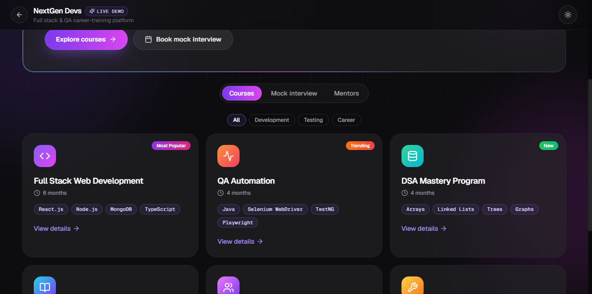
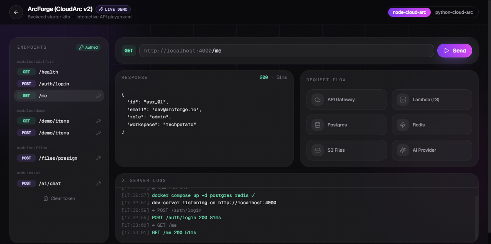
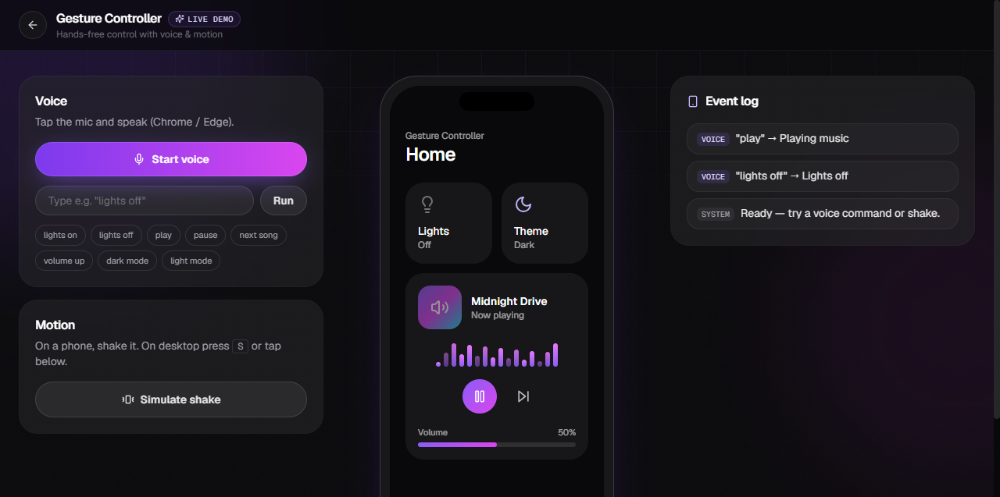
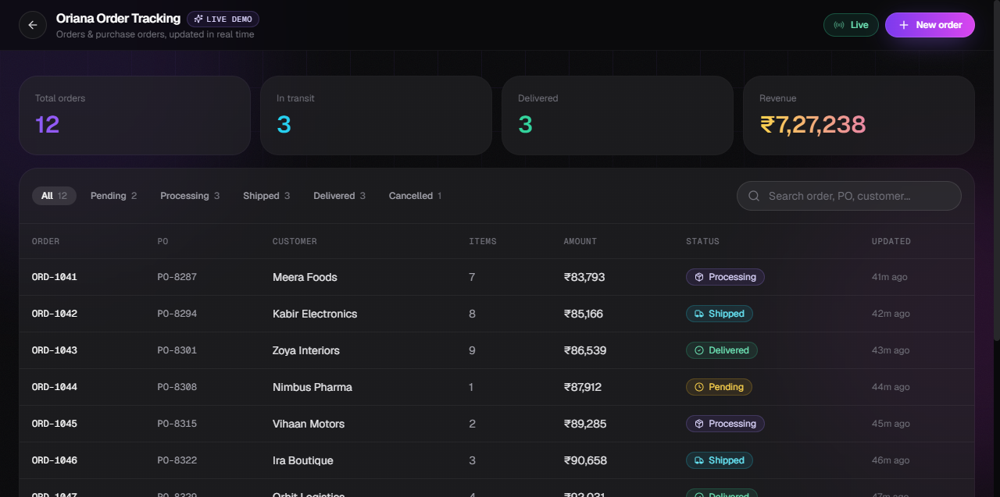
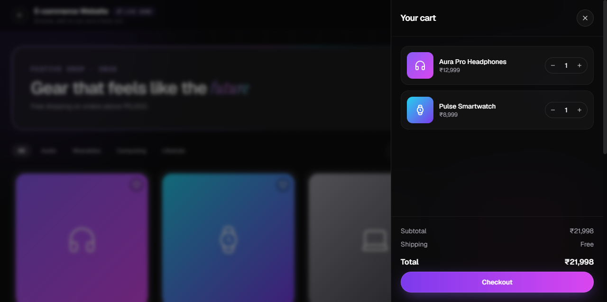
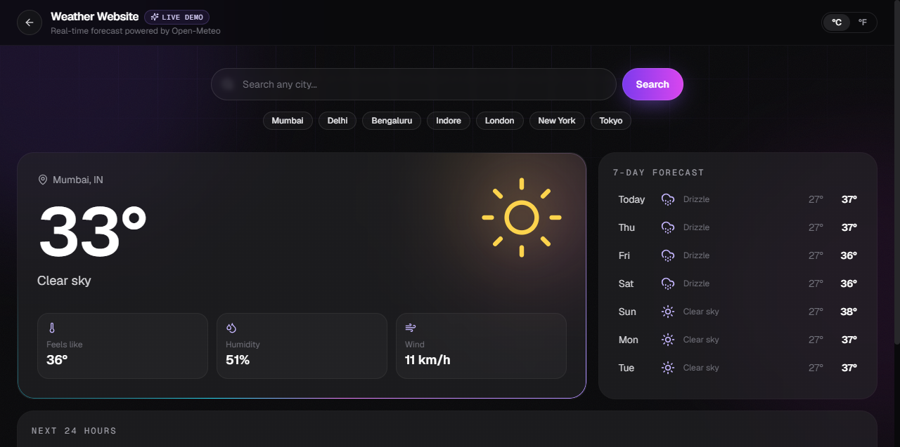

# Darshana Jain — Portfolio 2026

AI-styled developer portfolio built with React, TypeScript and Tailwind CSS — with an interactive live demo for every featured project.

**Live site:** https://darshana-portfolio.netlify.app
**Resume:** https://darshana-portfolio.netlify.app/resume.pdf


## Live demos

Every project card on the site has a **Live Demo** button that opens a fully interactive demo:

| Project | Live demo | What you can try |
|---|---|---|
| **NextGen Devs** — career-training platform | [Open demo](https://darshana-portfolio.netlify.app/?demo=nextgen) | Filter courses, view curriculum & enroll, book a mock interview, browse mentors, light/dark theme |
| **ArcForge (CloudArc v2)** — backend starter kits | [Open demo](https://darshana-portfolio.netlify.app/?demo=arcforge) | API playground: switch Node/Python kit, log in for a token, call endpoints, watch request flow & server logs |
| **ClipX** — browser video editor | [Open demo](https://darshana-portfolio.netlify.app/?demo=clipx) | Multi-track timeline, media library, playback and export flow |
| **Gesture Controller** — voice & motion app | [Open demo](https://darshana-portfolio.netlify.app/?demo=gesture) | Real voice commands (Chrome/Edge mic), shake detection on phones (`S` key on desktop) |
| **Oriana Order Tracking** — order dashboard | [Open demo](https://darshana-portfolio.netlify.app/?demo=oriana) | Live-updating order statuses, filters & search, order timeline drawer, new orders |
| **E-commerce Website** | [Open demo](https://darshana-portfolio.netlify.app/?demo=ecommerce) | Category filter, search & sort, wishlist, cart and checkout flow |
| **Weather Website** | [Open demo](https://darshana-portfolio.netlify.app/?demo=weather) | Real-time weather for any city (Open-Meteo), 7-day forecast, 24-hour chart, °C/°F |

> Weather uses live data from [Open-Meteo](https://open-meteo.com/). The other demos run entirely in the browser with sample data — no backend or payments involved.

### Screenshots

| | |
|---|---|
|  |  |
|  |  |
|  |  |

## Features

- AI-inspired 2026 design: aurora background, glass cards with cursor spotlight, gradient accents
- Typewriter hero, AI chat card and prompt bar with quick navigation
- Light / dark theme (dark by default)
- Downloadable resume
- Responsive and respects `prefers-reduced-motion`

## Tech stack

React 18 · TypeScript · Vite · Tailwind CSS · Lucide icons · Netlify

## Run locally

```bash
npm install
npm run dev
```

Open http://localhost:5173 — demos are available at `http://localhost:5173/?demo=<name>` (`nextgen`, `arcforge`, `clipx`, `gesture`, `oriana`, `ecommerce`, `weather`).

```bash
npm run build      # production build in dist/
npm run typecheck  # TypeScript check
```

## Project structure

```text
src/
├── components/
│   ├── Demos/          # interactive live demos (one per project)
│   ├── ClipXDemo/      # ClipX video editor demo
│   ├── Hero/ Navbar/ About/ Skills/ Experience/ Projects/ Contact/ Footer/
│   └── ProjectCard/    # project cards and preview mockups
├── data/portfolio.ts   # all content: profile, skills, experience, projects
└── hooks/              # theme, scroll reveal, card spotlight
public/resume.pdf       # resume served at /resume.pdf
```

To add or edit a project, update `src/data/portfolio.ts`.

## Contact

- GitHub: [Darshujain](https://github.com/Darshujain)
- LinkedIn: [darshana-jain](https://www.linkedin.com/in/darshana-jain-052a891b6/)
