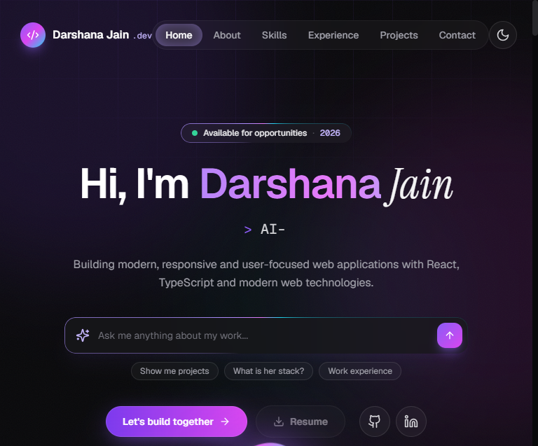
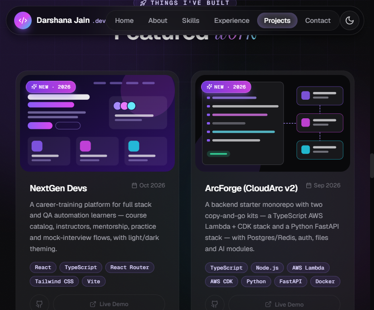

# Darshana Jain — Portfolio 2026

AI-styled developer portfolio built with React, TypeScript and Tailwind CSS.

**Live site:** https://darshana-portfolio.netlify.app
**Resume:** https://darshana-portfolio.netlify.app/resume.pdf



## Projects



## Features

- AI-inspired 2026 design: aurora background, glass cards with cursor spotlight, gradient accents
- Typewriter hero, AI chat card and prompt bar with quick navigation
- Light / dark theme (dark by default)
- Downloadable resume
- Responsive and respects `prefers-reduced-motion`

## Tech stack

React 18 · TypeScript · Vite · Tailwind CSS · Lucide icons · Netlify

## Run locally

```bash
npm install
npm run dev
```

Open http://localhost:5173 — the ClipX demo is at `http://localhost:5173/?demo=clipx`.

```bash
npm run build      # production build in dist/
npm run typecheck  # TypeScript check
```

## Project structure

```text
src/
├── components/
│   ├── ClipXDemo/      # ClipX video editor demo
│   ├── Hero/ Navbar/ About/ Skills/ Experience/ Projects/ Contact/ Footer/
│   └── ProjectCard/    # project cards and preview mockups
├── data/portfolio.ts   # all content: profile, skills, experience, projects
└── hooks/              # theme, scroll reveal, card spotlight
public/resume.pdf       # resume served at /resume.pdf
```

To add or edit a project, update `src/data/portfolio.ts`.

## Contact

- GitHub: [Darshujain](https://github.com/Darshujain)
- LinkedIn: [darshana-jain](https://www.linkedin.com/in/darshana-jain-052a891b6/)
